# SQL Analysis

---

# Dataset Overview

Before starting the analysis, I wanted to understand the overall size of the dataset.

### 01. Total Records

There are **2,796 funding records** available for analysis.

---

### 02. Unique Startups

The dataset contains **2,112 unique startups**, which means many companies appear multiple times because each row represents one funding event.

---

### 03. Unique Sectors

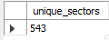

This gives an idea of how diverse the Indian startup ecosystem is before moving into the detailed analysis.

---

# Year-wise Analysis

I wanted to see how startup activity and funding changed over the years.

### 04. Number of Startups by Year

This shows how many unique startups received funding each year.

---

### 05. Total Funding by Year

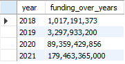

Along with the number of startups, I also checked the total funding received each year to understand how investments changed over time.

---

# Sector Analysis

Next, I wanted to see which sectors dominated the Indian startup ecosystem.

### 06. Top Sectors by Number of Startups

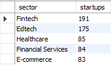

Fintech had the highest number of startups, followed by Edtech.

I wanted to check if the sectors with the highest number of startups also received the highest funding.

---

### 07. Top Sectors by Total Funding

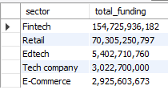

Fintech was still at the top, which made sense.

However, something looked unusual.

Edtech had one of the highest numbers of startups, yet Retail appeared as the second highest funded sector even though it wasn't among the top sectors by startup count.

So I decided to investigate the Retail sector separately.

---

## Retail Investigation

### 08. Number of Retail Startups

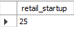

Retail had only **25 startups**, which seemed too few for such a huge funding amount.

So I checked all the funding records belonging to the Retail sector.

---

### 09. Retail Funding Records

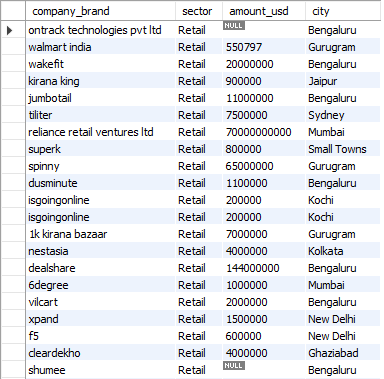

Here I found that **Reliance Retail Ventures Ltd.** alone had received around **$70 billion**.

That immediately looked like an outlier and explained why Retail ranked so highly in the funding analysis.

---

# Fintech Investigation

Since Fintech had the highest total funding, I wanted to see which companies contributed the most.

### 10. Company-wise Funding in Fintech

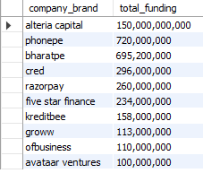

Once again, one company clearly stood out.

**Alteria Capital** had received around **$150 billion**, which was much larger than every other company.

I wanted to check whether this amount came from multiple funding rounds or just one.

---

### 11. Alteria Capital Funding Record

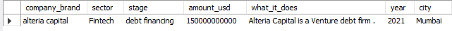

It turned out to be only **one funding event**.

If this amount had been spread across multiple funding rounds, it would have been easier to justify. Since it came from a single record, it looked like an outlier.

---

### 12. Alteria Capital's Contribution to Fintech Funding

Alteria Capital alone contributed around **96%** of the total funding received by the Fintech sector.

This confirmed that the sector's total funding is heavily influenced by one exceptionally large funding event.

---

# Overall Company Funding

### 13. Top Funded Companies

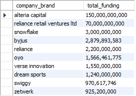

The same pattern appears here as well.

The highest funded companies are dominated by Alteria Capital and Reliance Retail Ventures Ltd., confirming that these unusually large funding events have a major impact on the overall funding analysis.

---

# City Analysis

Next, I compared cities based on both the number of startups and the total funding they received.

### 14. Cities with the Highest Number of Startups

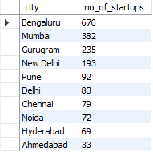

Bengaluru had the highest number of startups, followed by Mumbai.

---

### 15. Cities with the Highest Total Funding

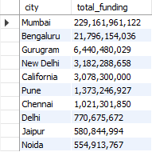

This time the ranking changed.

Mumbai moved to the top, followed by Bengaluru.

California also appeared among the highest funded cities even though it wasn't among the cities with the highest number of startups.

That looked interesting, so I explored it further.

---

## Mumbai Investigation

### 16. Company-wise Funding in Mumbai

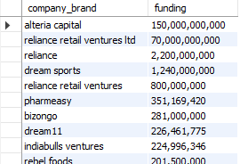

Alteria Capital and Reliance Retail Ventures Ltd. together contributed most of Mumbai's total funding.

---

### 17. Contribution of Alteria Capital and Reliance Retail

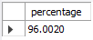

Together, these two companies contributed around **96%** of Mumbai's total funding, explaining why Mumbai ranked first despite having fewer startups than Bengaluru.

---

## California Investigation

### 18. Funding Records in California

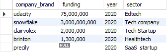

California had only **five companies**, but a few funding events of around **$3 billion** each were enough for it to appear among the top funded cities.

---

# Funding Stage Analysis

I also wanted to understand how funding varied across different funding stages.

### 19. Total Funding by Stage

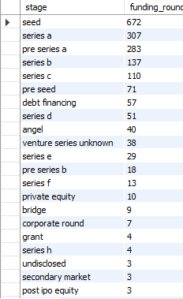

Debt Financing had the highest total funding.

However, I already knew that Alteria Capital belonged to this stage, so I suspected the total funding was heavily influenced by that single outlier.

---

### 20. Total Funding Across Funding Stages

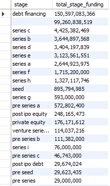

This gives an overall comparison of how much funding each investment stage received.

---

### 21. Average Funding and Number of Funding Rounds

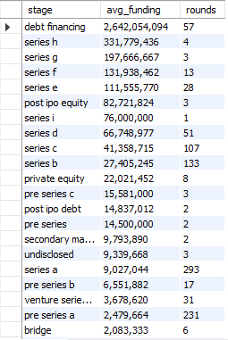

Instead of relying only on total funding, I also calculated the average funding amount along with the number of funding rounds.

I felt this gives a better representation because it also considers the sample size.

Even here, Debt Financing still had the highest average funding, although it is still influenced by Alteria Capital's exceptionally large funding amount.

---

# Company Funding History

### 22. Companies with the Most Funding Records

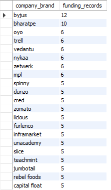

This shows the companies that appeared most frequently in the dataset, indicating multiple funding events over the years.

---

### 23. Byju's Funding History

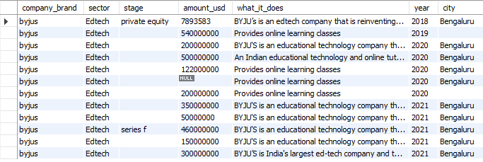

Byju's appeared multiple times across different years, showing that it raised funding through several funding rounds over time.

---

### 24. BharatPe Funding History

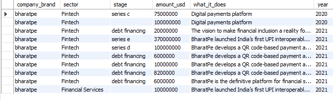

Similarly, BharatPe also received funding across multiple years, reflecting its growth over time.

---

# Data Quality Check

### 25. Null and Blank Values in the Stage Column

Finally, I checked the number of null and blank values in the `stage` column to verify that the imported data matched the cleaned dataset and that no unexpected missing values were introduced during the import process.
