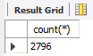
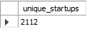
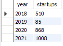
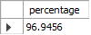

# SQL Analysis

---

# Dataset Overview

Before starting the analysis, I wanted to understand the size of the dataset.

### Total Records



There are **2796 funding records** available for analysis.

---

### Unique Startups



The dataset contains 2112 unique startups, which means many companies appear multiple times because they have multiple funding events (each row is one funding event)

---

### Unique Sectors


This gives an idea of how diverse the Indian startup ecosystem is before moving into the detailed analysis.

---

# Year-wise Analysis

I wanted to see how startup activity changed over the years.

### Number of startups each year

**Query**

```sql
...
```

**Output**



This shows how many distinct startups appeared each year.

---

### Funding over the years

**Query**

```sql
...
```

**Output**


Along with the number of startups, I also checked the total funding received each year to understand how investments changed over time.

---

# Sector Analysis

Next, I wanted to see which sectors dominated the Indian startup ecosystem.

### Top sectors by startup count

**Query**

```sql
...
```

**Output**


Fintech had the highest number of startups, followed by Edtech.

I wanted to check if the sectors with the most startups also received the highest funding.

---

### Top sectors by total funding

**Query**

```sql
...
```

**Output**


Fintech was still at the top, so that made sense.

But something looked unusual.

Edtech had one of the highest numbers of startups, yet Retail appeared as the second highest funded sector even though it wasn't even among the top sectors by startup count.

So I decided to investigate Retail separately.

---

## Retail Investigation

### Number of Retail startups

**Query**

```sql
...
```

**Output**


Retail had only **25 startups**, which seemed too few for such a huge funding amount.

So I checked all the Retail funding records.

---

### Retail funding records

**Query**

```sql
...
```

**Output**


Here I found that **Reliance Retail Ventures Ltd.** alone had received around **$70 billion**.

That immediately looked like an outlier and explained why Retail ranked so high in the funding analysis.

---

# Fintech Investigation

Since Fintech had the highest funding overall, I wanted to see which companies contributed the most.

### Top funded Fintech startups

**Query**

```sql
...
```

**Output**


Once again, one company clearly stood out.

**Alteria Capital** had received around **$150 billion**, which was much larger than every other company.

I wanted to check whether this amount came from multiple funding rounds or just one.

---

### Alteria Capital records

**Query**

```sql
...
```

**Output**


It turned out to be only **one funding event**.

If this amount had been spread across multiple rounds, it would have been easier to justify.

Since it came from a single record, it looked like an outlier.

---

### Contribution to Fintech funding

**Query**

```sql
...
```

**Output**



Alteria Capital alone contributed around **96%** of the total funding received by the Fintech sector.

This confirmed that the sector's total funding is heavily influenced by one extremely large funding event.

---

# Top Funded Companies

### Query

```sql
...
```

**Output**


The same pattern appears here as well.

The top companies are dominated by Alteria Capital and Reliance Retail Ventures Ltd., confirming that these large funding events significantly influence the overall funding analysis.

---

# City Analysis

Next, I compared cities based on the number of startups and the total funding they received.

### Cities with most startups

**Output**


Bengaluru had the highest number of startups, followed by Mumbai.

---

### Cities with highest funding

**Output**


This time the ranking changed.

Mumbai moved to the top, followed by Bengaluru.

California also appeared among the highest funded cities even though it wasn't among the cities with the highest number of startups.

That looked interesting, so I explored it further.

---

# Mumbai Investigation

### Top funded startups in Mumbai

**Output**


Alteria Capital and Reliance Retail Ventures Ltd. together contributed most of Mumbai's funding.

---

### Contribution

**Output**


Together they contributed around **96%** of Mumbai's total funding, explaining why Mumbai ranked first despite having fewer startups than Bengaluru.

---

# California Investigation

### Output


California had only **five companies**, but a few funding events of around **$3 billion** each were enough for it to appear among the top funded cities.

---

# Funding Stage Analysis

I wanted to understand how funding varied across different funding stages.

### Total funding by stage

**Output**


Debt Financing had the highest total funding.

However, I already knew Alteria Capital belonged to this stage, so I suspected the total was influenced by the outlier.

---

### Average funding by stage

**Output**


Instead of relying only on total funding, I also calculated the average funding amount along with the number of funding rounds.

I felt this gives a better representation because it considers the sample size as well.

Even here, Debt Financing still had the highest average funding, although it is still influenced by Alteria Capital's exceptionally large funding amount.

---

# Company Funding History

### Byju's


Byju's appeared multiple times across different years, showing multiple funding events over time.

---

### BharatPe


Similarly, BharatPe also received funding across multiple years, reflecting its growth over time.

---

# Data Quality Check


Finally, I checked the number of null and blank values in the `stage` column to verify that the imported data matched the cleaned dataset.
